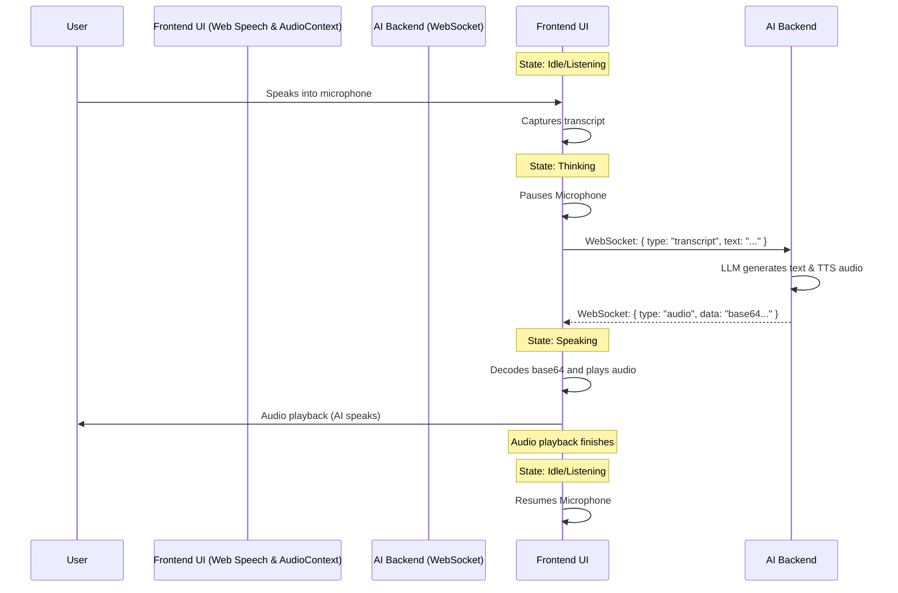

# Frontend UI and AI Voice Interaction Architecture

This document describes how the  frontend interface interacts with the AI backend throughout its entire vocal conversation lifecycle—handling speech recognition (listening), processing (thinking), and speech synthesis (talking).

## Architecture Overview

The system operates using a four-phase **State Machine**:
1. **Idle / Listening** 
2. **Thinking** 
3. **Speaking**
4. **Task / Working** (Variation of Thinking)

Communication between the Frontend UI and the AI backend happens in real-time over **WebSockets** (specifically on port `8340`), sending user transcripts and receiving synthesized audio payloads. The visual state is reflected via an interactive Orb (`orb.ts`), with animations synchronized to the AI's audio output.

---

## 1. When the AI Starts Listening (User is talking)

The frontend uses the browser's native **Web Speech API** (`SpeechRecognition` or `webkitSpeechRecognition`) to capture the user's microphone input.

- **Initialization:** When the UI loads and is not muted, it waits 1 second for the visual orb to render, then enters the `listening` state.
- **Continuous Recognition:** The app actively listens for microphone input, waiting for the user to speak. 
- **Trigger:** Web Speech recognition triggers a `final` result (`event.results[i].isFinal === true`).
- **Action:** The text transcript string is captured and packaged into a JSON payload: `{ "type": "transcript", "text": "...", "isFinal": true }`.
- **Cancellation:** If the user starts talking while the AI is in the middle of a previous speech track, the frontend instantly stops the AI's current audio playback (`audioPlayer.stop()`) and sends the new transcript.

## 2. When the Voice Connects to the AI (Processing / Thinking)

Once a transcript is successfully sent to the backend, the system pauses the microphone and transitions modes.

- **State Transition:** The UI transitions from `listening` to `thinking`.
- **Microphone paused:** The Voice input system is deliberately paused (`recognition.stop()` with a paused flag). This prevents the AI from accidentally capturing background noise or a delayed user utterance.
- **Waiting:** The frontend waits for the AI (on the server side) to generate a response text and transform it into audio via Text-to-Speech (TTS).

## 3. When the AI is Talking

When the AI finishes processing, the backend streams the audio response to the frontend over WebSocket.

- **Payload Received:** The frontend receives a WebSocket message containing `{ "type": "audio", "data": "<Base64 Encoded Audio>" }`.
- **State Transition:** The UI transitions from `thinking` to `speaking`. 
- **Enqueuing Audio:** The base64 audio data is decoded using the browser's native **AudioContext** API into an `AudioBuffer`. 
- **Playback & Visualization:** 
  - The `AudioPlayer` plays the decoded sequence.
  - While audio plays, an `AnalyserNode` provides real-time frequency data to the visual Orb. The Orb physically pulses and animates based on the volume and frequency of the AI's synthesized voice.
- **Listening restriction:** During the `speaking` phase, the microphone remains paused so the AI doesn't hear an echo of its own voice and try to respond to it.

## 4. When the Interaction Stops (Completion)

Once all scheduled audio buffers finish playing, the frontend automatically wraps up the loop and prepares for the next command.

- **End of Queue:** The `AudioPlayer` fires an `onFinished` callback.
- **State Transition:** The UI officially switches from `speaking` back to `idle`.
- **Microphone Restart:** Unless the user manually pressed "Mute", the Speech Recognition engine is immediately told to `.resume()`. The interaction loop starts over from step 1.

---

### Sequence Diagram Summary

